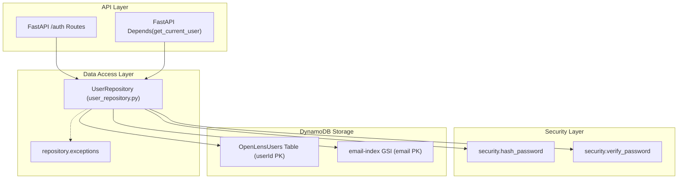

# OpenLens Core — User Repository

The **`UserRepository`** is the Data Access Layer (DAL) for managing user identity and credentials in OpenLens Core. It encapsulates all Amazon DynamoDB interactions for the `OpenLensUsers` table, enforcing security invariants, email uniqueness, and data sanitization.

---

## 🏛️ Architecture Overview

The repository isolates persistence logic from the API layer (FastAPI routers and dependencies) and works seamlessly with the security module (`argon2id` and `PyJWT`).



---

## 📊 DynamoDB Table Schema (`OpenLensUsers`)

| Attribute | DynamoDB Type | Role | Description |
| :--- | :--- | :--- | :--- |
| `userId` | `String (S)` | **Partition Key (HASH)** | Unique user identifier (`usr_` + UUIDv4 hex) |
| `email` | `String (S)` | **GSI Partition Key (`email-index`)** | Normalized lowercase user email address |
| `passwordHash` | `String (S)` | Stored Credential | RFC 9106 Argon2id encoded password hash |
| `fullName` | `String (S)` | Profile Attribute | User's full name (optional) |
| `isActive` | `Boolean (BOOL)` | Account State | Account status flag (defaults to `True`) |
| `createdAt` | `String (S)` | Audit Timestamp | ISO-8601 UTC timestamp of creation |
| `updatedAt` | `String (S)` | Audit Timestamp | ISO-8601 UTC timestamp of last update |

### Secondary Index: `email-index`
* **Type**: Global Secondary Index (GSI)
* **Partition Key**: `email` (`S`)
* **Projection**: `ALL`
* **Purpose**: Enables sub-5ms lookups by email during registration and login without performing expensive full table scans.

---

## 🛠️ Public API (`UserRepository`)

### Initialization
```python
from repository import UserRepository

# Uses default connection from storage.py and settings.dynamodb_users_table
repo = UserRepository()

# Or inject custom DynamoDB resource / table name for testing
repo = UserRepository(dynamodb_resource=custom_dynamodb, table_name="CustomTable")
```

### 1. `create_user(email, password, full_name=None)`
Persists a new user record in DynamoDB.
* **Email Normalization**: Converts email to lowercase and strips whitespace.
* **Collision Check**: Queries `email-index` GSI. If the email is already registered, raises `UserAlreadyExistsError`.
* **Password Hashing**: Hashes raw password using Argon2id (`security.hash_password`). Plaintext passwords are never persisted or logged.
* **ID Generation**: Assigns a unique `usr_<uuid>` primary key.
* **Sanitized Return**: Returns a user dictionary **without** `passwordHash`.

```python
user = repo.create_user(
    email="engineer@openlens.ai",
    password="SuperSecretPassword123!",
    full_name="OpenLens Engineer"
)
# Returns:
# {
#     "userId": "usr_4f1b8a...",
#     "email": "engineer@openlens.ai",
#     "fullName": "OpenLens Engineer",
#     "isActive": True,
#     "createdAt": "2026-09-23T16:00:00Z",
#     "updatedAt": "2026-09-23T16:00:00Z"
# }
```

### 2. `get_user_by_email(email, include_password_hash=False)`
Retrieves a user record using the `email-index` GSI.
* Case-insensitive lookup.
* By default, strips `passwordHash` to prevent accidental credential leakage.

```python
user = repo.get_user_by_email("engineer@openlens.ai")
```

### 3. `get_user_by_id(user_id, include_password_hash=False)`
Performs an ultra-fast `GetItem` against the table's primary key (`userId`).
* Used by FastAPI's `get_current_user` dependency for authenticated API endpoints.

```python
user = repo.get_user_by_id("usr_4f1b8a...")
```

### 4. `authenticate_user(email, password)`
Verifies credentials during user login.
* Fetches user by email including the password hash.
* Validates that `isActive` is `True`.
* Verifies plaintext password against Argon2id hash using constant-time comparison (`security.verify_password`).
* Returns sanitized user dictionary on success, or `None` on invalid credentials or inactive account.

```python
user = repo.authenticate_user("engineer@openlens.ai", "SuperSecretPassword123!")
if user:
    token = create_access_token(user["userId"])
```

---

## ⚠️ Exception Hierarchy (`repository.exceptions`)

The repository uses domain-specific exceptions, keeping it decoupled from FastAPI's HTTP status codes:

```python
RepositoryError (Base)
├── UserAlreadyExistsError  # Raised when duplicate email is registered
└── UserNotFoundError       # Raised when expected user does not exist
```

---

## 🔒 Security & Invariant Guarantees

1. **Zero Credential Leakage**: `_sanitize_user()` automatically purges `passwordHash`, `password`, and `password_hash` from all standard read outputs.
2. **Argon2id Standards**: Strictly uses the RFC 9106 recommended Argon2id configuration with unique per-password cryptographic salts.
3. **Sub-millisecond Primary Key Lookups**: Session resolution and `/auth/me` requests use `userId` directly via `GetItem`, minimizing DynamoDB Read Capacity Units (RCUs).
4. **Collision Resistance**: Case-insensitive normalization ensures `User@Example.com` and `user@example.com` collide deterministically, preventing duplicate accounts.

---

## 🧪 Verification & Testing

A standalone test suite validates all repository functions, GSI queries, and security guarantees against DynamoDB Local:

```powershell
# From services/core directory:
.venv\Scripts\python.exe verify_user_repository.py
```

### Test Coverage:
* `[PASS]` User creation with sanitized response (no `passwordHash`).
* `[PASS]` DynamoDB persistence verification with valid `$argon2id$` hash.
* `[PASS]` Duplicate email registration rejection (`UserAlreadyExistsError`).
* `[PASS]` GSI query verification (`get_user_by_email`).
* `[PASS]` Primary Key direct lookup (`get_user_by_id`).
* `[PASS]` `authenticate_user` verification (valid passwords, invalid passwords, nonexistent accounts).
* `[PASS]` Automated test record cleanup.
